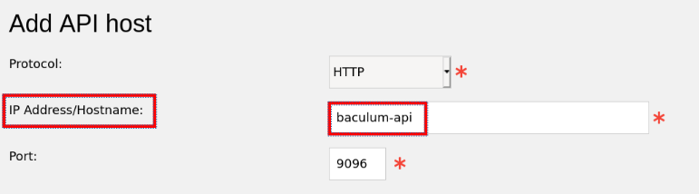

## Description

This is the Bacula Community Edition deployed on the official Debian Bullseye Docker image. The Bacula Catalog image is using the official Postgresql 13 Docker image.
The timezone in the containers is inherited from the local time zone on the docker host.

**Requirements**

You need a x86-64 based Linux host system with installed docker engine and docker-compose.

**Upgrade from version 11.0.5 to 11.0.5-1**

In the version 11.0.5-1 the Debian distribution in the image has changed from Buster to Bullseye.
The Debian Bullseye distribution brings the database postgresql in version 13 instead of version 11 in Buster.
To migrate the database you need to create a dump of the existing DB with the following command:

`docker exec -t docker_bacula_compose_db_1 pg_dumpall -c -U bacula > db_dump.sql`

After this step, replace the docker-compose.yaml with the new version.
Then follow the steps described below.
When you have the new version up and running, import the dump of the postgresql dump with the following command:
`cat db_dump.sql | docker exec -i bacula-ce_db_1 psql -U bacula`

In case you didn't use version 11.0.5, you can ignore this section

**Download the Docker images**

```
git clone https://github.com/ixxoid/bacula-ce
cd bacula-ce
docker-compose up -d
```

## Setup / Configuration

**Baculum API configuration**

Open the Baculum API Website at http://docker-host:9096
The default login is:

- username = admin
- password = admin

The login data can be changed in the gui.
You need to go through the "Configuration wizard".
All the forms will be filled out with a working configuration.
In the step 5 - "authentication to API" you need to choose "Use HTTP Basic authentication". 
For more details on the Baculum API configuration, consult the linked documentation below.

**Baculum web configuration**

Open the Baculum Web page at http://docker-host:9095
You need to go through the configuration forms.
On the page "Add API host" add "baculum-api" in the field "IP-Address/Hostname", this is the default set in the docker-compose.yaml.

****

If you enter the wrong hostname by mistake and safe the configuration, you might get an unrecoverable fault. In that case you need to recreate the Baculum Web container.
This seems to be a bug of Baculum Web.

**Bacula configuration**

The included example configuration uses a volume to share the bacula working directory /opt/bacula/working . This allows to backup the catalog db dumps.
To adapt the configuration to you personal needs, you can either edit the config files in /etc or change the config in the Baculum Web Gui.

## Tests

Login to the Baculum Web page at http://docker-host:9095
Open the Bacula Console with clicking on ">_".  
Type "status all" and click on "Enter".  
Check the output for any faults.

****

## Security

You might want to limit access to the DB port 5432.
To enable SSL encryption for the baculum-api and baculum-web access, you can add a reverse proxy to the docker-compose.yaml

## Customize / Build the images

If you want to customize or build the images on your own, you need to get your access key from https://www.bacula.org/bacula-binary-package-download/ . After you get your own access key, you need to replace "ACCESS_KEY"  in the file  "bacula-ce/Bacula_Common/files/Bacula-Community.list" with your own key.


## Links

Bacula homepage:
https://www.bacula.org/

Baculum (bacula-gui):
https://baculum.app/doc/index.html

**PostgreSQL**
https://hub.docker.com/_/postgres/
